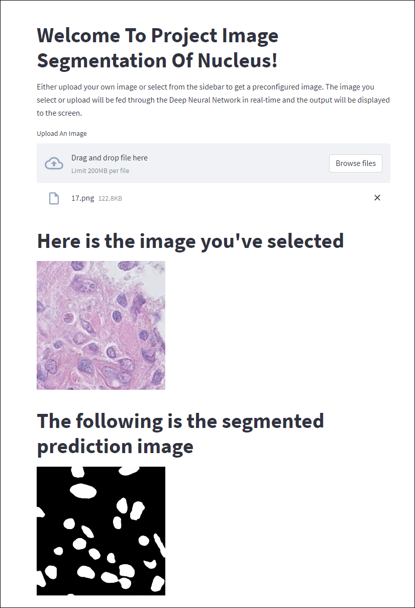

 

# Medical Image Nuclear Segmentation
Before I go over anything else, here's a link the website hosting the app:

[Segmentation Homepage](https://binbin-2593-medical-image-nuclear-segmentatio-srcdisplay-cnn9qf.streamlit.app)

Technologies used: 
* Python
* Pytorch
* Streamlit
* Docker

# Summary
This project uses semantic segmentation depth learning neural network to segment the nucleus of medical image. See archs.py for related network. The trained model is then deployed to an interactive web site for shared use.

# Dataset
The dataset used for this project is  [TNBC](https://zenodo.org/record/1175282#.ZFuHAhFBxPa) nuclei segmentation dataset. You can also use the dataset after our preprocessing, which can be downloaded [here](https://drive.google.com/file/d/16ajg19swFmvFqkH5sxsdoI3GX4aqjRB6/view) .

The images in this data set are histopathology stained with hematoxylin and eosin, as follows:
### Image:

### Mask:

# Streamlit App

I created a publically hosted application using Streamlit to showcase this project and allow users to interact with the trained model with a no-code implimentation.Users can upload the same type of image for segmentation prediction, web page will show the results of segmentation prediction. 

Note that my training image size is 256 * 256, different sizes uploaded by users will be resize 256 * 256, may affect the segmentation results.

